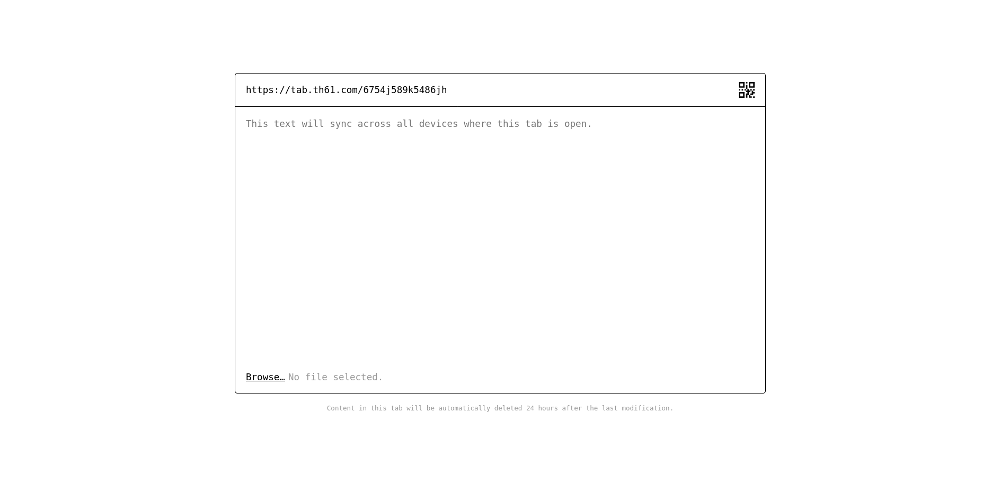

# Seamlessly Syncable Tab Across Devices

A shared text/file clipboard that allows you to effortlessly sync content across all your internet-connected devices.

## Getting Started

Follow these steps to set up and run the project on your own:

1. **Set Up a PocketBase Instance**. You can either host your own PocketBase instance using [dokku-pocketbase](https://github.com/blockshiftnetwork/dokku-pocketbase) or sign up for a free instance at [PocketHost](https://pockethost.io/).

2. Import the collection from `pb_schema.json` by navigating to **Settings > Import Collections**.

   **Important:** Make sure to check the option "Merge with existing collections" during the import process.

3. Copy the `tab.pb.js` file into the `pb_hooks` folder of your PocketBase instance. This hook will clean up the database by removing records older than one day.

3. **Update the PocketBase URL**: in the `dist/index.html` file, replace `https://pb.th61.com` with the URL of your PocketBase instance.

4. **Deploy to Dokku**. Follow your usual deployment process to deploy the application to Dokku.

## Contributing

We welcome contributions! Please feel free to submit issues or pull requests.

## License

This project is licensed under the MIT License. See the [LICENSE](LICENSE) file for details.
